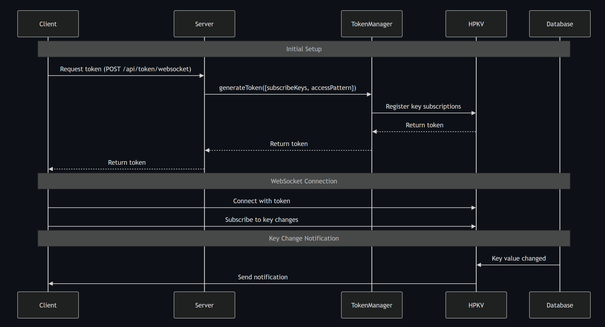

# HPKV WebSocket Client SDK

A WebSocket client SDK for interacting with the [HPKV](https://hpkv.io/) (High-Performance Key-Value) service. This SDK provides real-time data access and updates through WebSocket connections.

## Features

- CRUD operations on HPKV databse using Web socket
  - get, set, delete, partial update, atomic increment/decrement, range queries 
- Publisher/Subscriber for real-time key monitoring
- Automatic reconnection handling
- TypeScript support with full type definitions
- Lightweight with minimal dependencies
- Promise-based API for easy integration

## Pre-Requisites

You need an HPKV API key. You can sign up and generate a free key [here](https://hpkv.io/signup).

Find your HPKV API key and urls at[ HPKV Dashboard](https://hpkv.io/dashboard/api-keys)

## Installation

```bash
npm install @hpkv/websocket-client
```

## Overview

The SDK provides two main types of clients:

1. **HPKVApiClient**: For performing CRUD operations using web scoket connection to databse. This client uses API key to establish a web socket connection, therefore it's supposed to be used in your server-side code as API key should not be exposed at the client side. It exposes methods for:
   - get, set, delete
   - Range queries
   - Atomic operations
   - Partial update and JSON patching operations

2. **HPKVSubscriptionClient**: This client is used for key monitoring and subscribing to changes in the key values. It uses a token generated by **WebsocketTokenManager**, to eastablish a web socket connection. During token generation, you can specify which keys to subscribe to and limit the permitted CRUD operations to specific keys. As HPKV allows a bi-directional web socket connection, this client can be used to receive notifications when subscribed keys change and also perform CRUD operation, However, unlike **HPKVApiClient**, the CRUD operations can be limited to specific keys only.
As it uses tokens to connect to databse, this client can be used on both server-side and client-side code, However for using it in the client-side, you need to create an API endpoint in the backend for token generation. See the usage section below for more details.
This client exposes methods for:
   - get, set, delete, partial updates, range queries and atmoic operations, only on the keys specified by access pattern (during token generation)
   - Subscribe/UnSubscribe to changes in the key values

## Usage

### HPKVApiClient

The `HPKVApiClient` is designed exclusively for server-side operations where you have direct access to your API key. This client provides full access to all HPKV operations and should never be used in client-side code.

```typescript
import { HPKVClientFactory } from '@hpkv/websocket-client';

// Create a client for server-side operations
const apiClient = HPKVClientFactory.createApiClient(
  'your-api-key',
  'your-hpkv-api-base-url'
);

// Connect to the server
await apiClient.connect();

// Basic CRUD Operations
await apiClient.set('my-key', 'my-value');
const result = await apiClient.get('my-key');
await apiClient.delete('my-key');

// Partial Updates (JSON Patch)
const userData = {
  name: 'John Doe',
  email: 'john@example.com',
  preferences: {
    theme: 'dark',
    notifications: true
  }
};
await apiClient.set('user:123', userData);

// Update only specific fields
await apiClient.patch('user:123', {
  preferences: {
    theme: 'light',
    notifications: false
  }
});

// Range Queries
// Get users with IDs between 100 and 200
const users = await apiClient.range('user:100', 'user:200', {
  limit: 50
});

// Atomic Operations
// Increment a counter
await apiClient.atomicIncrement('counter:123', 1);

// Decrement a counter
await apiClient.atomicIncrement('counter:123', -1);

// Cleanup
apiClient.disconnect();
```

### HPKVSubscriptionClient

The `HPKVSubscriptionClient` is designed for applications that need real-time key monitoring and pub/sub functionality. It can be used on both server and client sides, making it perfect for:
- Real-time data synchronization
- Live updates and notifications
- Collaborative features
- Monitoring key changes

#### Token Generation
`HPKVSubscriptionClient` uses tokens to connect to HPKV databse. Use `WebsocketTokenManager` to generate tokens. For generating tokens, you need to specify:
  - List of keys to monitor
  - Access pattern (optional) to specify on which keys CRUD operations are allowed.

Please not that the token expires in 2 hours and you need to generate a new token.

```typescript
import WebsocketTokenManager from '@hpkv/websocket-client';

// Create token manager
const tokenManager = new WebsocketTokenManager('your-api-key', 'your_api_base_url');

// Generate token that monitors system:events key in the database and allows CRUD operations only on the keys starting with system:
const token = await tokenManager.generateToken({
  subscribeKeys: ['system:events'],
  accessPattern: '^system:.*$'
});
```
#### Subscribing to Changes
Once you generated the token, you can use it to connect and get notification when value of the subscribed key changes in the database. The pub/sub system works through a bi-directional WebSocket connection. Any change to a monitored key (whether through WebSocket or REST API) will trigger notifications to all connected clients that are subscribed to that key.
```typescript
import HPKVClientFactory from '@hpkv/websocket-client';

// Create subscription client using the generated token
const subscriptionClient = HPKVClientFactory.createSubscriptionClient(
  token,
  'your_api_base_url'
);

await subscriptionClient.connect();

// Monitor system events. The key provided to subscribe method, must be one of the keys provided to WebsocketTokenManager to generate token
subscriptionClient.subscribe('system:events', (data) => {
  console.log('System event:', data);
  // Process the event...
});

//You can also perform CRUD operations only on the keys specified during token generation
const logs = await subscriptionClient.get("system:logs")
await subscriptionClient.set("system:logs","log entry")

```

#### Using HPKVSubscriptionClient on Client-Side

To use `HPKVSubscriptionClient` in your client-side code, you need to setup an API endpoint to generate the token and invoke it from client-side to generate token for connection.

```typescript
// First, call your token generation API endpoint to get a token. Implement 
const response = await fetch('https://your-server.com/api/token/websocket', {
  method: 'POST',
  headers: {
    'Authorization': 'Bearer your-user-token'
  }
});
const { token } = await response.json();

// Create subscription client
const subscriptionClient = HPKVClientFactory.createSubscriptionClient(
  token,
  'your_api_base_url'
);

await subscriptionClient.connect();

// Subscribe to key changes
subscriptionClient.subscribe('user:123', (data) => {
  console.log('User data updated:', data);
  // Update UI...
});
```
This is an example on how to implement your token generation api endpoint at the server side.

```typescript
import { WebsocketTokenManager } from '@hpkv/websocket-client';
import express from 'express';

const app = express();
const tokenManager = new WebsocketTokenManager('your-api-key', 'your api base url');

// Implement your own authentication middleware here
app.use('/api/token', authenticateUser);

app.post('/api/token/websocket', async (req, res) => {
  try {
    // Generate a token with specific access patterns and keys to monitor
    const token = await tokenManager.generateToken({
      subscribeKeys: ['user:123', 'product:456'], // Keys to monitor
      accessPattern: '^(user|product):[0-9]+'     // Regex pattern for allowed operations
    });
    
    res.json({ token });
  } catch (error) {
    res.status(500).json({ error: 'Failed to generate token' });
  }
});
```
Below diagram illustrates the process for token generation and usage at the client-side:




#### Notes

1. **Real-time Notifications**: The subscription system will notify clients of any changes to monitored keys, regardless of how the change was made:
   - Changes through WebSocket API
   - Changes through REST API

2. **Access Pattern**: The `accessPattern` parameter in token generation restricts which keys the token can perform operations on. This pattern is a regex that validates keys for all operations except subscription notifications. You can
generate tokens that allow operations on specific keys, or deny operations on any key or allow operations on all keys.

3. **Multiple Subscribers**: Multiple clients can subscribe to the same key, and all will receive notifications when the key changes.

## API Reference

### HPKVClientFactory

The factory class for creating appropriate client instances:

```typescript
class HPKVClientFactory {
  static createApiClient(apiKey: string, baseUrl: string): HPKVApiClient;
  static createSubscriptionClient(token: string, baseUrl: string): HPKVSubscriptionClient;
}
```

### HPKVApiClient

```typescript
class HPKVApiClient {
  constructor(apiKey: string, baseUrl: string);
  
  // Connection Management
  connect(): Promise<void>;
  disconnect(): void;
  getConnectionStatus(): boolean;
  
  // CRUD Operations
  get(key: string): Promise<HPKVResponse>;
  set(key: string, value: any): Promise<HPKVResponse>;
  delete(key: string): Promise<HPKVResponse>;
  
  // Advanced Operations
  patch(key: string, value: any): Promise<HPKVResponse>;  // JSON patch operation
  range(key: string, endKey: string, options: { limit?: number }): Promise<HPKVResponse>;
  atomicIncrement(key: string, value: number): Promise<HPKVResponse>;
}
```

### HPKVSubscriptionClient

```typescript
class HPKVSubscriptionClient {
  constructor(token: string, baseUrl: string);
  
  // Connection Management
  connect(): Promise<void>;
  disconnect(): void;
  getConnectionStatus(): boolean;
  
  // Subscription Operations
  subscribe(key: string, callback: (data: any) => void): void;
  unsubscribe(key: string): void;
  
  // Inherits CRUD operations from BaseWebSocketClient
  // Operations are restricted by the access pattern specified in token generation
}
```

### WebsocketTokenManager

```typescript
class WebsocketTokenManager {
  constructor(apiKey: string, baseUrl: string);
  
  generateToken(config: {
    subscribeKeys: string[];      // Keys to monitor for changes
    accessPattern?: string;       // Regex pattern for allowed keys. The keys specified with this regex pattern are the ones that client will have access for CRUD operations
  }): Promise<string>;
}
```

## Example Usage Scenarios

### Real-time Collaboration

```typescript
// Server-side: Generate token with specific access pattern
const token = await tokenManager.generateToken({
  subscribeKeys: ['document:123'],
  accessPattern: '^document:123$'
});

// Client-side: Subscribe to document changes
const client = HPKVClientFactory.createSubscriptionClient(token, baseUrl);
await client.connect();

client.subscribe('document:123', (data) => {
  // Update UI with new document content
  updateDocumentUI(data.value);
});
```

### Live Dashboard

```typescript
// Server-side: Generate token for dashboard metrics
const token = await tokenManager.generateToken({
  subscribeKeys: ['metrics:*'],
  accessPattern: '^metrics:.*$'
});

// Client-side: Subscribe to real-time metrics
const client = HPKVClientFactory.createSubscriptionClient(token, baseUrl);
await client.connect();

client.subscribe('metrics:users', (data) => {
  updateUserCount(data.value);
});

client.subscribe('metrics:revenue', (data) => {
  updateRevenueChart(data.value);
});
```

## Best Practices

1. **Token Generation**:
   - Always generate tokens on your server
   - Implement proper authentication for token generation endpoint
   - Use restrictive access patterns to limit the keys that subscribers are permitted to run CRUD operations on

2. **Connection Management**:
   - Handle token regeneration and reconnection attempts as the generated tokens expire after 2 hours
   - Implement proper cleanup to disconnect when the connection is not needed

## Read More

  - [Introducing HPKV Pub/Sub Feature](https://hpkv.io/docs/websocket-api)
  - [HPKV Websocket API Documentation](https://hpkv.io/blog/2025/03/real-time-pub-sub)

## License

MIT
