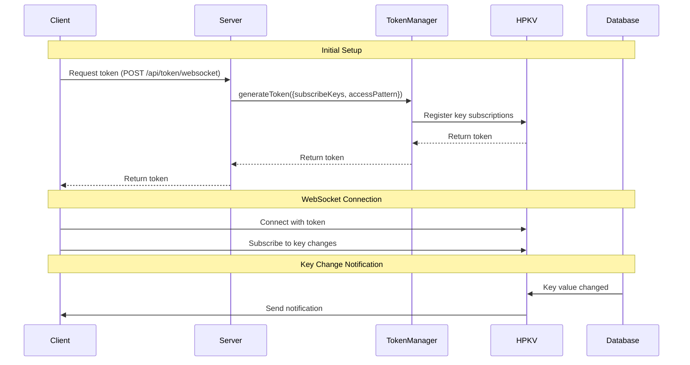

# HPKV WebSocket Client SDK

A lightweight and efficient WebSocket client SDK for interacting with the [HPKV](https://hpkv.io/) (High-Performance Key-Value) service. This SDK provides real-time data access and updates through WebSocket connections.

## Features

- Real-time data access and updates
- Support for partial updates, range queries, and atomic operations
- Bi-directional WebSocket pub-sub system for real-time key monitoring
- Automatic reconnection handling
- Support for both API key and token-based authentication
- TypeScript support with full type definitions
- Lightweight with minimal dependencies
- Promise-based API for easy integration

## Pre-Requisites

You need an HPKV API key. You can sign up and generate a free key [here](https://hpkv.io/signup).

Find your HPKV API key and urls at[ HPKV Dashboard](https://hpkv.io/dashboard/api-keys)

## Installation

```bash
npm install @hpkv/websocket-client
```

## Architecture Overview

The SDK provides two main types of clients:

1. **HPKVApiClient**: For server-side operations using API keys
   - Full CRUD operations
   - Range queries
   - Atomic operations
   - JSON patch operations
   - Server-side only (never use in client-side code)

2. **HPKVSubscriptionClient**: For pub/sub operations using tokens
   - CRUD operations on the keys specified by access pattern
   - Real-time key monitoring
   - Pub-sub functionality
   - Secure token-based authentication
   - Can be used on both server and client side

## Usage

### Server-Side Operations (Connecting using API Key)

The `HPKVApiClient` is designed exclusively for server-side operations where you have direct access to your API key. This client provides full access to all HPKV operations and should never be used in client-side code.

```typescript
import { HPKVClientFactory } from '@hpkv/websocket-client';

// Create a client for server-side operations
const apiClient = HPKVClientFactory.createApiClient(
  'your-api-key',
  'wss://api.hpkv.io'
);

// Connect to the server
await apiClient.connect();

// Basic CRUD Operations
await apiClient.set('my-key', 'my-value');
const result = await apiClient.get('my-key');
await apiClient.delete('my-key');

// Partial Updates (JSON Patch)
const userData = {
  name: 'John Doe',
  email: 'john@example.com',
  preferences: {
    theme: 'dark',
    notifications: true
  }
};
await apiClient.set('user:123', userData);

// Update only specific fields
await apiClient.patch('user:123', {
  preferences: {
    theme: 'light',
    notifications: false
  }
});

// Range Queries
// Get users with IDs between 100 and 200
const users = await apiClient.range('user:100', 'user:200', {
  limit: 50
});

// Get all products in a category
const products = await apiClient.range('product:category1:', 'product:category1:~');

// Atomic Operations
// Increment a counter
await apiClient.atomicIncrement('counter:123', 1);

// Decrement a counter
await apiClient.atomicIncrement('counter:123', -1);

// Cleanup
apiClient.disconnect();
```

### Pub/Sub Operations (Connecting using token)

The `HPKVSubscriptionClient` is designed for applications that need real-time key monitoring and pub/sub functionality. It can be used on both server and client sides, making it perfect for:
- Real-time data synchronization
- Live updates and notifications
- Collaborative features
- Monitoring key changes

#### How It Works

The pub/sub system works through a bi-directional WebSocket connection. Any change to a monitored key (whether through WebSocket or REST API) will trigger notifications to all connected clients that are subscribed to that key.



#### Server-Side Usage

When using `HPKVSubscriptionClient` on the server side, you can directly use `WebsocketTokenManager` to generate tokens:

```typescript
import { WebsocketTokenManager, HPKVClientFactory } from '@hpkv/websocket-client';

// Create token manager
const tokenManager = new WebsocketTokenManager('your-api-key', 'your_api_base_url');

// Generate token directly
const token = await tokenManager.generateToken({
  subscribeKeys: ['system:events'],
  accessPattern: '^system:.*$'
});

// Create subscription client
const subscriptionClient = HPKVClientFactory.createSubscriptionClient(
  token,
  'your_api_base_url'
);

await subscriptionClient.connect();

// Monitor system events
subscriptionClient.subscribe('system:events', (data) => {
  console.log('System event:', data);
  // Process the event...
});
```

#### Client-Side Usage

For client-side applications, you'll need to set up a token generation endpoint on your server:

```typescript
import { WebsocketTokenManager } from '@hpkv/websocket-client';
import express from 'express';

const app = express();
const tokenManager = new WebsocketTokenManager('your-api-key', 'your api base url');

// Implement your own authentication middleware here
app.use('/api/token', authenticateUser);

app.post('/api/token/websocket', async (req, res) => {
  try {
    // Generate a token with specific access patterns and keys to monitor
    const token = await tokenManager.generateToken({
      subscribeKeys: ['user:123', 'product:456'], // Keys to monitor
      accessPattern: '^(user|product):[0-9]+'     // Regex pattern for allowed operations
    });
    
    res.json({ token });
  } catch (error) {
    res.status(500).json({ error: 'Failed to generate token' });
  }
});
```

Then in your client-side code:

```typescript
// First, get a token from your server
const response = await fetch('https://your-server.com/api/token/websocket', {
  method: 'POST',
  headers: {
    'Authorization': 'Bearer your-user-token'
  }
});
const { token } = await response.json();

// Create subscription client
const subscriptionClient = HPKVClientFactory.createSubscriptionClient(
  token,
  'your_api_base_url'
);

await subscriptionClient.connect();

// Subscribe to key changes
subscriptionClient.subscribe('user:123', (data) => {
  console.log('User data updated:', data);
  // Update UI...
});
```

#### Important Notes

1. **Real-time Notifications**: The subscription system will notify clients of any changes to monitored keys, regardless of how the change was made:
   - Changes through WebSocket API
   - Changes through REST API

2. **Access Pattern**: The `accessPattern` parameter in token generation restricts which keys the token can perform operations on. This pattern is a regex that validates keys for all operations except subscription notifications.

3. **Multiple Subscribers**: Multiple clients can subscribe to the same key, and all will receive notifications when the key changes.

## API Reference

### HPKVClientFactory

The factory class for creating appropriate client instances:

```typescript
class HPKVClientFactory {
  static createApiClient(apiKey: string, baseUrl: string): HPKVApiClient;
  static createSubscriptionClient(token: string, baseUrl: string): HPKVSubscriptionClient;
}
```

### HPKVApiClient

The client for server-side operations with full access:

```typescript
class HPKVApiClient {
  constructor(apiKey: string, baseUrl: string);
  
  // Connection Management
  connect(): Promise<void>;
  disconnect(): void;
  getConnectionStatus(): boolean;
  
  // CRUD Operations
  get(key: string): Promise<HPKVResponse>;
  set(key: string, value: any): Promise<HPKVResponse>;
  delete(key: string): Promise<HPKVResponse>;
  
  // Advanced Operations
  patch(key: string, value: any): Promise<HPKVResponse>;  // JSON patch operation
  range(key: string, endKey: string, options: { limit?: number }): Promise<HPKVResponse>;
  atomicIncrement(key: string, value: number): Promise<HPKVResponse>;
}
```

### HPKVSubscriptionClient

The client for client-side operations with token-based access:

```typescript
class HPKVSubscriptionClient {
  constructor(token: string, baseUrl: string);
  
  // Connection Management
  connect(): Promise<void>;
  disconnect(): void;
  getConnectionStatus(): boolean;
  
  // Subscription Operations
  subscribe(key: string, callback: (data: any) => void): void;
  unsubscribe(key: string): void;
  
  // Inherits CRUD operations from BaseWebSocketClient
  // Operations are restricted by the access pattern specified in token generation
}
```

### WebsocketTokenManager

The class for managing tokens on the server side:

```typescript
class WebsocketTokenManager {
  constructor(apiKey: string, baseUrl: string);
  
  generateToken(config: {
    subscribeKeys: string[];      // Keys to monitor for changes
    accessPattern?: string;       // Regex pattern for allowed keys. The keys specified with this regex pattern are the ones that client will have access for CRUD operations
  }): Promise<string>;
}
```

## Some Real-World Usage Examples

### Real-time Collaboration

```typescript
// Server-side: Generate token with specific access pattern
const token = await tokenManager.generateToken({
  subscribeKeys: ['document:123'],
  accessPattern: '^document:123$'
});

// Client-side: Subscribe to document changes
const client = HPKVClientFactory.createSubscriptionClient(token, baseUrl);
await client.connect();

client.subscribe('document:123', (data) => {
  // Update UI with new document content
  updateDocumentUI(data.value);
});
```

### Live Dashboard

```typescript
// Server-side: Generate token for dashboard metrics
const token = await tokenManager.generateToken({
  subscribeKeys: ['metrics:*'],
  accessPattern: '^metrics:.*$'
});

// Client-side: Subscribe to real-time metrics
const client = HPKVClientFactory.createSubscriptionClient(token, baseUrl);
await client.connect();

client.subscribe('metrics:users', (data) => {
  updateUserCount(data.value);
});

client.subscribe('metrics:revenue', (data) => {
  updateRevenueChart(data.value);
});
```

## Best Practices

1. **Token Generation**:
   - Always generate tokens on your server
   - Implement proper authentication for token generation
   - Use restrictive access patterns to limit the keys that subscribers are permitted to run CRUD operations on

2. **Connection Management**:
   - Handle token regeneration and reconnection attempts as the token expires every two hours
   - Implement proper cleanup to disconnect when the connection is not needed

3. **Security**:
   - Never expose API keys in client-side code
   - Use HTTPS/WSS for all connections
   - Implement proper authentication for your token generation endpoint
   - Use restrictive access patterns in tokens

## Read More

  - [Introducing HPKV Pub/Sub Feature](https://hpkv.io/docs/websocket-api)
  - [HPKV Websocket API Documentation](https://hpkv.io/blog/2025/03/real-time-pub-sub)

## License

MIT
