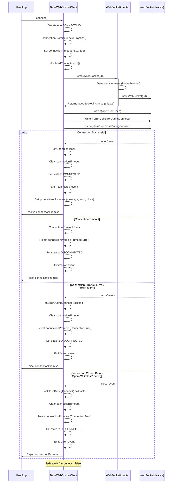
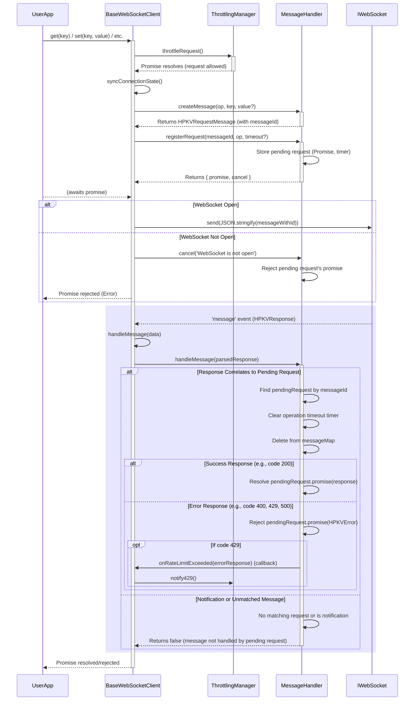
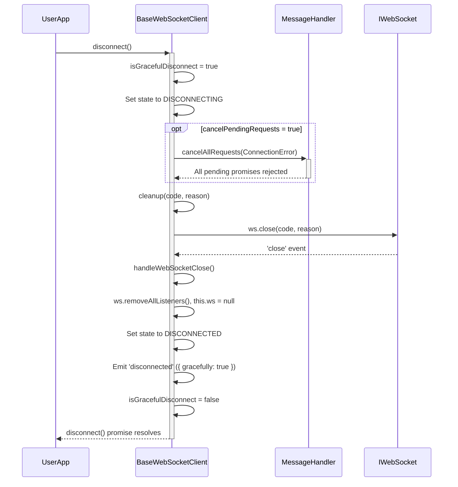
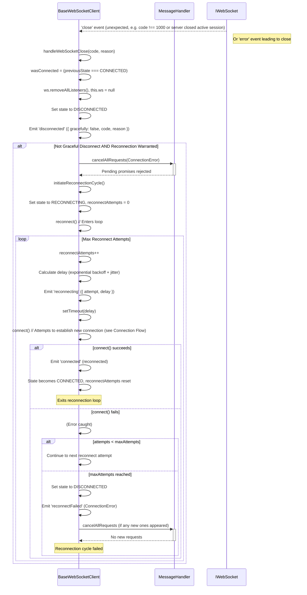

# HPKV WebSocket Client Documentation

## 1. Overview

This document details the technical design, architecture, and behavior of the HPKV WebSocket Client. The client is designed to provide a resilient and robust interface for interacting with an HPKV (Key-Value Store) backend via WebSockets. It handles connection management, message passing, error recovery, and provides a simple API for data operations.

The client is composed of several key TypeScript modules:
- `base-websocket-client.ts`: The core abstract class for the WebSocket client.
- `message-handler.ts`: Manages request/response lifecycles and timeouts.
- `websocket-adapter.ts`: Provides a consistent WebSocket interface for different JavaScript environments (Node.js and Browser).
- `throttling-manager.ts`: (Mentioned in `BaseWebSocketClient`) Handles client-side request throttling.
- `types.ts`: Contains type definitions and enums.
- `errors.ts`: Defines custom error classes.

## 2. Core Components

### 2.1. `BaseWebSocketClient` (`base-websocket-client.ts`)

This abstract class is the heart of the client.
- **Responsibilities:**
    - Establishing and maintaining the WebSocket connection.
    - Managing connection states (`ConnectionState`: `DISCONNECTED`, `CONNECTING`, `CONNECTED`, `DISCONNECTING`, `RECONNECTING`).
    - Implementing API operations (`get`, `set`, `delete`, `range`, `atomicIncrement`).
    - Handling automatic reconnections with exponential backoff and jitter.
    - Emitting events for connection lifecycle changes (`connected`, `disconnected`, `reconnecting`, `reconnectFailed`, `error`).
    - Managing graceful and ungraceful disconnections.
    - Integrating `MessageHandler` for request/response management and `ThrottlingManager` for rate limiting.
- **Key Features:**
    - Abstract `buildConnectionUrl()`: Must be implemented by subclasses to provide the specific WebSocket URL (e.g., with authentication tokens).
    - Connection timeout for initial connection attempts.
    - Robust cleanup mechanisms (`cleanup()`, `disconnect()`, `destroy()`).
    - Synchronization of internal `connectionState` with the actual WebSocket `readyState`.

### 2.2. `MessageHandler` (`message-handler.ts`)

Manages the lifecycle of individual messages sent to and received from the server.
- **Responsibilities:**
    - Assigning unique `messageId` to outgoing requests.
    - Storing pending requests (`messageMap`) with their corresponding `Promise` resolve/reject functions and operation-specific timeouts.
    - Matching incoming responses from the server to their original requests using `messageId`.
    - Handling operation timeouts for individual requests.
    - Differentiating between standard responses and server-initiated notifications.
    - Invoking a callback (`onRateLimitExceeded`) when a rate limit error (e.g., HTTP 429) is received.
    - Periodically cleaning up stale requests.
    - Cancelling all pending requests upon disconnection or client destruction.
- **Key Features:**
    - Configurable operation timeouts (`DEFAULT_TIMEOUTS.OPERATION`).
    - Safe `messageId` generation to prevent overflow.

### 2.3. `WebSocketAdapter` (`websocket-adapter.ts` - via `createWebSocket`)

Provides a normalized `IWebSocket` interface, abstracting away the differences between Node.js (`ws` library) and browser-native `WebSocket` implementations.
- **Responsibilities:**
    - Detecting the runtime environment (Node.js or browser).
    - Wrapping the native WebSocket object.
    - Providing a consistent API for `on()`, `removeListener()`, `removeAllListeners()`, `send()`, `close()`, and `readyState`.
    - Handling JSON parsing for incoming messages and adapting event argument structures.
- **Key Features:**
    - Environment auto-detection.
    - Simplified event management through an internal listener store to correctly map and remove listeners.

### 2.4. `ThrottlingManager`

(Assumed functionality based on its usage in `BaseWebSocketClient`)
- **Responsibilities:**
    - Implementing client-side request throttling to prevent overwhelming the server or hitting rate limits.
    - Managing a queue or delay mechanism for outgoing requests.
    - Potentially adjusting throttling behavior based on server feedback (e.g., 429 responses).
- **Key Features:**
    - Configurable throttling parameters.
    - Metrics for monitoring throttling behavior.

## 3. Technical Design and Architecture

### 3.1. Layered Architecture

The client follows a layered design:
1.  **Adapter Layer (`websocket-adapter.ts`):** The lowest layer, providing a consistent WebSocket API across environments.
2.  **Messaging Layer (`message-handler.ts`):** Sits above the adapter, managing the request-response flow and operational timeouts.
3.  **Client Core Logic (`base-websocket-client.ts`):** The highest layer, orchestrating connections, reconnections, API method calls, and overall client state. It utilizes the messaging and adapter layers.

### 3.2. Event-Driven

The system is heavily event-driven.
- Native WebSocket events (`open`, `message`, `error`, `close`) drive the core connection logic.
- `SimpleEventEmitter` is used by `BaseWebSocketClient` to emit custom, higher-level events (`connected`, `disconnected`, etc.) for consumers of the client.

### 3.3. State Machine

`BaseWebSocketClient` employs a state machine (`connectionState`) to manage and track the client's status:
- `ConnectionState.DISCONNECTED`: No active connection, not attempting to connect. Operations will typically fail or be queued if a connect attempt is made.
- `ConnectionState.CONNECTING`: Client is attempting to establish the initial WebSocket connection. `connectionPromise` is active. Operations sent during this state might be queued or wait for connection.
- `ConnectionState.CONNECTED`: WebSocket connection is successfully established and open. Client can send and receive messages. `reconnectAttempts` is reset.
- `ConnectionState.DISCONNECTING`: Client has initiated a graceful disconnect via `disconnect()`. `isGracefulDisconnect` is true. Pending requests might be cancelled.
- `ConnectionState.RECONNECTING`: An unexpected disconnection occurred, and the client is automatically attempting to re-establish the connection. `reconnectAttempts` tracks the number of attempts. The client uses exponential backoff with jitter between attempts.

Transitions between these states are carefully managed in response to events and method calls.

### 3.4. Asynchronous Operations

All network operations and many internal processes are asynchronous, primarily using Promises. This ensures non-blocking behavior, crucial for responsive applications.

### 3.5. Error Handling and Resilience

- **Custom Errors:** Specific error types (`ConnectionError`, `TimeoutError`, `HPKVError`) provide detailed context.
- **Timeouts:**
    - **Connection Timeout (`DEFAULT_TIMEOUTS.CONNECTION`):** For the initial establishment of the WebSocket connection.
    - **Operation Timeout (`DEFAULT_TIMEOUTS.OPERATION`):** For individual API requests (e.g., `get`, `set`), managed by `MessageHandler`.
    - **Cleanup Timeout (`DEFAULT_TIMEOUTS.CLEANUP`):** For `MessageHandler` to remove stale, unresponsive requests.
- **Automatic Reconnection:** `BaseWebSocketClient` implements an exponential backoff strategy with jitter for reconnection attempts after unexpected disconnections. This helps to manage server load and recover from transient network issues.
- **Graceful Disconnection:** The `disconnect()` method allows for intentional, clean closure of the connection.
- **Pending Request Cancellation:** Upon fatal errors or disconnections, `MessageHandler` cancels all pending requests, rejecting their promises with an appropriate error.

### 3.6. Abstraction and Separation of Concerns

- `BaseWebSocketClient` is abstract, deferring URL construction (`buildConnectionUrl`) to subclasses, allowing for flexible authentication or configuration.
- `MessageHandler` isolates the complexities of message tracking and timeout management.
- `WebSocketAdapter` isolates platform-specific WebSocket implementation details.
- `ThrottlingManager` encapsulates request rate-limiting logic.

## 4. Key Processes and Flows

### 4.1. Connection Establishment Flow

### 4.2. Message Sending and Receiving Flow

### 4.3. Disconnection and Reconnection Flow

#### 4.3.1. Graceful Disconnection

#### 4.3.2. Unexpected Disconnection and Reconnection Attempt

## 5. Detailed Behavior and Conditions

### 5.1. Connection States (`ConnectionState`)

-   **`DISCONNECTED`**: The initial state, or after a connection has been closed (gracefully or not) and no reconnection attempts are active. Operations will typically fail or be queued if a connect attempt is made.
-   **`CONNECTING`**: Client is attempting to establish the initial WebSocket connection. `connectionPromise` is active. Operations sent during this state might be queued or wait for connection.
-   **`CONNECTED`**: WebSocket connection is successfully established and open. Client can send and receive messages. `reconnectAttempts` is reset.
-   **`DISCONNECTING`**: Client has initiated a graceful disconnect via `disconnect()`. `isGracefulDisconnect` is true. Pending requests might be cancelled.
-   **`RECONNECTING`**: An unexpected disconnection occurred, and the client is automatically attempting to re-establish the connection. `reconnectAttempts` tracks the number of attempts. The client uses exponential backoff with jitter between attempts.

### 5.2. Handling of WebSocket Events

-   **`open`**:
    -   During initial connect (`onOpen` in `connect()`): Clears connection timeout, sets state to `CONNECTED`, resolves `connectionPromise`, emits `'connected'`, attaches persistent message/error/close handlers.
-   **`message`**:
    -   Handled by the persistent message handler attached after connection.
    -   Passes data to `this.handleMessage()`, which delegates to `MessageHandler.handleMessage()` to resolve/reject the corresponding request promise.
-   **`error`**:
    -   During initial connect (`onErrorDuringConnect` in `connect()`): Clears connection timeout, rejects `connectionPromise`, sets state to `DISCONNECTED`, emits `'error'`.
    -   Persistent handler (`handleWebSocketError`): Emits an `'error'` event. Usually followed by a `close` event. Primarily for logging and notifying consumers.
-   **`close`**:
    -   During initial connect (`onCloseDuringConnect` in `connect()`): Clears connection timeout, rejects `connectionPromise`, sets state to `DISCONNECTED`, emits `'error'`.
    -   Persistent handler (`handleWebSocketClose`): This is a critical handler.
        -   Sets `ws` to `null` after removing listeners.
        -   Sets `connectionState` to `DISCONNECTED`.
        -   Emits `'disconnected'` event with details (code, reason, graceful).
        -   If `isGracefulDisconnect` is `false` (unexpected close):
            -   Cancels all pending requests via `MessageHandler`.
            -   If the close code indicates an abnormal closure (not code 1000) or if it was a normal closure of a previously connected session, it calls `initiateReconnectionCycle()`.
        -   If `isGracefulDisconnect` is `true`, it resets the flag.

### 5.3. Timeout Mechanisms

-   **Connection Timeout (`DEFAULT_TIMEOUTS.CONNECTION`):** Set in `connect()`. If the WebSocket `open` event isn't received within this duration, the `connectionPromise` is rejected with a `TimeoutError`, and the client attempts to clean up the nascent WebSocket instance.
-   **Operation Timeout (`DEFAULT_TIMEOUTS.OPERATION`):** Managed by `MessageHandler.registerRequest()`. Each outgoing request has a timer. If a response isn't received within this duration, the request's promise is rejected with a `TimeoutError`.
-   **Stale Request Cleanup (`MessageHandler.timeouts.CLEANUP`):** `MessageHandler` periodically checks for requests that have been pending for an exceptionally long time (e.g., 3x `OPERATION` timeout) and cleans them up to prevent memory leaks, rejecting their promises.
-   **Cleanup Timeout (in `BaseWebSocketClient.cleanup()`):** When `cleanup()` is called (e.g., during `disconnect()`), it waits a short period for the WebSocket `close` event. If the event doesn't fire, it forces resource release to prevent hangs.

### 5.4. Retry Strategy (`reconnect()` method)

-   Triggered by `initiateReconnectionCycle()` after an unexpected disconnection.
-   `reconnectAttempts` is incremented for each attempt in the current cycle.
-   Delay calculation: `(initialDelay * 2^(attempts-1)) + jitter`, capped by `maxDelayBetweenReconnects`.
-   Emits `'reconnecting'` event with attempt details.
-   Calls `this.connect()` for each attempt.
    -   If `connect()` succeeds: `connectionState` becomes `CONNECTED`, `'connected'` event is emitted, and `reconnectAttempts` is reset by the `connect` method itself. The cycle ends.
    -   If `connect()` fails:
        -   If `reconnectAttempts < maxReconnectAttempts`, the `reconnect()` method calls itself recursively (or schedules the next attempt).
        -   If `maxReconnectAttempts` is reached, `connectionState` becomes `DISCONNECTED`, a final `ConnectionError` is thrown (and caught by the `.catch` in `initiateReconnectionCycle`), `'reconnectFailed'` event is emitted, and all pending requests are cancelled.

### 5.5. Graceful vs. Ungraceful Disconnections

-   **Graceful (`isGracefulDisconnect = true`):**
    -   Initiated by calling `client.disconnect()`.
    -   The `isGracefulDisconnect` flag is set to `true`.
    -   The client attempts to close the WebSocket cleanly (`ws.close()`).
    -   No automatic reconnection attempts are made.
    -   The `'disconnected'` event includes `gracefully: true`.
    -   `isGracefulDisconnect` flag is reset to `false` after the disconnect process completes.
-   **Ungraceful (`isGracefulDisconnect = false`):**
    -   Occurs due to network issues, server-side closure, or WebSocket errors.
    -   The `handleWebSocketClose` method detects this (as `isGracefulDisconnect` is `false`).
    -   Pending requests are cancelled.
    -   An automatic reconnection cycle is typically initiated (unless already connecting/reconnecting or if retry conditions are not met).
    -   The `'disconnected'` event includes `gracefully: false`.

### 5.6. Error Propagation and Event Emission

-   **`ConnectionError`**: Used for issues related to establishing or maintaining the connection (e.g., initial connection failure, unexpected close).
-   **`TimeoutError`**: Used when an operation or connection attempt exceeds its allotted time.
-   **`HPKVError`**: Represents errors reported by the HPKV server in a response (e.g., invalid key, permission denied). It includes a `code` from the server response.
-   Events emitted by `BaseWebSocketClient.emitter`:
    -   `'connected'`: After successful connection or reconnection.
    -   `'disconnected'`: After the WebSocket closes. Payload: `{ code, reason, previousState, gracefully }`.
    -   `'reconnecting'`: Before a reconnection attempt. Payload: `{ attempt, maxAttempts, delay }`.
    -   `'reconnectFailed'`: After all reconnection attempts have failed. Payload: `ConnectionError`.
    -   `'error'`: When a WebSocket error occurs or a connection-related error is detected. Payload: `Error` (usually `ConnectionError` or `TimeoutError`).

This documentation should provide a comprehensive understanding of the HPKV WebSocket client's design and behavior. 